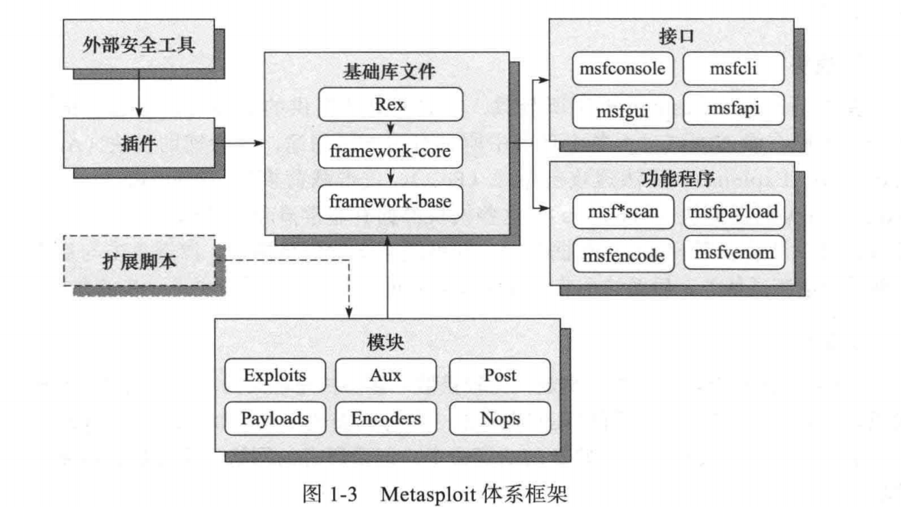

# Kali

Kali Linux是一个基于Debian的Linux发行版，旨在进行高级渗透测试和安全审计。Kali包含数百种工具，适用于各种信息安全任务，如渗透测试，安全研究，计算机取证和逆向工程。Kali Linux由领先的信息安全培训公司Offensive Security开发，资助和维护。

参考:
[What is Kali](https://docs.kali.org/introduction/what-is-kali-linux)
[Kali 安装](https://jingyan.baidu.com/article/380abd0a1d066a1d91192c5c.html)

## Metasploit
2003年，HD Moore开发了开源项目Metasploit。

2007年，Metasploit使用Ruby重构，原本用的是Perl。

2009年，Rapid7买下了它，这是一家生产了漏洞扫描器Nexpose的信息安全公司。



### 基础库文件: 分为Rex, framework-core和framework-base三部分.
Rex是整个框架所依赖的最基础的一些组件，如包装的网络套接字、网络应用协议客户端与服务端实现、日志子系统、渗透攻击支持例程、PostgreSQL以及MySQL数据库支持等；
framework-core库负责实现所有与各种类型的上层模块及插件的交互接口；
framework-base库扩展了framework-core，提供更加简单的包装例程，并未处理框架各个方面的功能提供了一些功能类，用于支持用户接口与功能程序调用框架本身功能及框架集成模块;

### 模块
模块是通过Metasploit框架所装载、集成并对外提供的最核心的渗透测试功能实现代码。
分为辅助模块（Aux)、渗透攻击模块（Exploits)、后渗透攻击模块（Post)、攻击载荷模块（payloads)、编码器模块（Encoders)、空指令模块（Nops)。

- Payloads 指的是入侵一个系统后留在那里的代码。一些人称之为监听器、rootkits之类的。在Metasploit里面，叫playloads。这些payloads包括命令行工具，Meterpreter等等。payloads的类型有staged，inline，NoNX(绕过某些现代CPU的不可执行特性)，PassiveX（绕过防火墙的限制出站规则），IPv6等等.


- Exploits 指的是利用系统漏洞或者缺陷的攻击程序。它们针对特定的操作系统，而且经常是特定的SP（service pack），特定的服务，特定的端口，甚至特定的应用程序。它们按操作系统分类，所以Windows exploits无法用于Linux，反之亦然。

- Post 指的是用来向目标系统发送漏洞攻击程序的模块。

- Nops 是No Operations的缩写。在X86中，通常用16进制的0x90表示。简言之，“什么也不做”。它可以成为创建缓冲区溢出的关键。我们可以使用show命令查看nops。

- Auxiliary 放的是各种不适合放在其它目录的模块（695）。包括了模糊测试工具，扫描器，拒绝服务攻击器等等。想深入了解这个模块，请参考我的文章《附加模块》。

- Encoders 是一个让我们可以通过各种方式对payloads进行编码的模块，目标是绕过防病毒程序和其它的安全设备。

Metasploit框架的接口:
msfconsole 提供"一体化"集中控制台,可以高效访问MSF中几乎所有可用选项.
msfcli命令行、msfgui图形化界面、armitage图形化界面以及msfapi远程调用接口。

### 核心指令备忘录及相关脚本命令
参考:
https://null-byte.wonderhowto.com/how-to/hack-like-pro-ultimate-command-cheat-sheet-for-metasploits-meterpreter-0149146/
https://null-byte.wonderhowto.com/how-to/hack-like-pro-ultimate-list-hacking-scripts-for-metasploits-meterpreter-0149339/


### Msfvenom

移除metasploit-framework版本中的msfencoder和msfpayload，并使用msfvenom取代。

```sh
./msfvenom -p plateform -x template -f exe -o /tmp/hack.exe
```

参考:

[Msfvenom](https://www.freebuf.com/sectool/72135.html)


参考:
metasploit 渗透测试魔鬼训练营.pdf

[metasploit体系框架介绍](https://www.cnblogs.com/blacksunny/p/5254904.html)

[metasploit rapid7](https://metasploit.help.rapid7.com/docs)

[看雪 metasploit](https://bbs.pediy.com/thread-225012.htm)

[MSFconsole](https://www.offensive-security.com/metasploit-unleashed/Msfconsole/)

[metasploit msf](https://www.kalilinux.in/2019/02/metasploit-msf.html)


