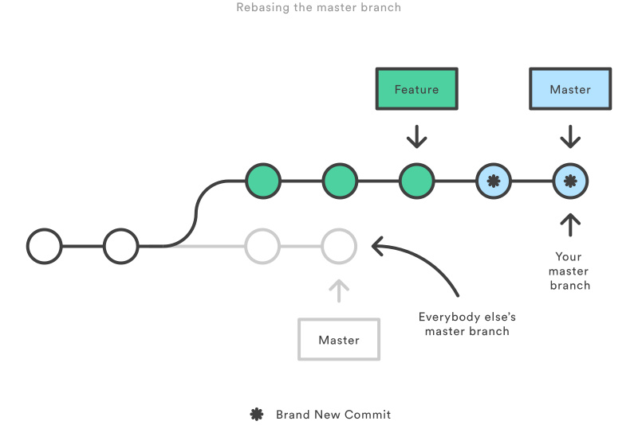

# Git

## git rebase

https://git-scm.com/docs/git-rebase

merge 和 rebase 的区别?

### Megre

将master 合并到feature 可以使用下面的命令:
git merge master feature


Advance:

Merge好在它是一个安全的操作. 现有的分支不会被更改, 避免了rebase潜在的缺点.

Disadvance:

每次合并上游修改时feature分支都会引入一个外来的合并提交.若master非常活跃,这或多或少会污染你的分支历史.

### Rebase

将feature分支并入master分支:
git checkout feature
git rebase master

它会把整个feature分支移动到master分支的后面, 有效地把所有分支上新的提交并入过来. 但是, rebase为源分支上每一个提交创建一个新的提交,重写了项目历史,并且不会带来合并提交.

Advance:

rebase的好处是最后项目历史呈现出完美的线性, 你可以从项目终点到起点浏览而不需要任何fork.使得你更容易使用`git log`, `git bisect`, `gitk`来查看项目历史.

Disadvance:

这种简单地提交历史会带来两个后果: 安全性和可跟踪性. 若你违反 rebase黄金法则, 重写项目历史可能会给你的协作工作流带来灾难性的影响. 此外, rebase 不会有合并提交中附带的信息, 你看不到feature分支中并入了上游的哪些更改.


### Rebase的黄金法则

当你理解rebase是什么的时候,最重要的就是什么时候不能用rebase.
`git rebase`黄金法则便是, 绝对不要在公共分支上使用它.

比如, 如果你把master分支rebase到你的featuer上会发生下图含义:



这次rebase将master分支上的所有提交都移到了feature分支后面.
*问题是它只发生在你的代码仓库,其他所有的开发者还在原来的master上工作. 由rebase引起新的提交, Git会认为你的master分支和其他人的master已经分叉了.*

同步两个master分支的唯一办法是把它们merge到一起, 导致一个额外的合并提交和两堆包含同样修改的提交,这样会让人非常困惑.

SO: 在你运行`git rebase`之前, 一定要问问你自己有没有别人正在这个分支上工作?
如果有,那么把你的爪子放回去, 重新找到一个无害的方式(如`git revert`)来提交你的更改.

## 工作流

- 第一步 在任何和`git rebase`有关的工作流中为每一个feature专门创建一个分支.


- 本地清理

在工作流中使用rebase最好的方法之一就是清理本地正在开发的分支.隔一段时间执行一次交互式rebase，n你可以保证你的feature分支中每一个提交都是专注和有意义的.

调用`git rebase`时, 有两个基(base)可以选择: 上游分支(比如master)或你feature分支中最先的一个提交.

后一种在当你只需要修改最新几次提交时也很有用.

git checkout feature
git rebase -i HEAD~3


若想用这个方法重写整个feature分支, `git merge-base`命令非常方便找出feature分支开始分叉的基.
下面这段名称返回基提交的ID, 你可以接下来将他传给`git rebase`:

git merge-base feature master

- 将上游分支上的更改并入feature分支

`git merge`或 `git rebase`来并入上游分支. merge是保留完整历史的安全选择, rebase将你的feature分支移动到master后面,创建一个线性的历史.

> 记住: rebase到远程分支而不是master也是完全合法的.当你和另一个开发者在同一个feature分支上协作是,你会用到这个方法, 将他们的更改并入你的项目.

比如,如果你和另一个开发者John往feature分支上添加了几个提交, 在从John的仓库中fetch之后,你的仓库可能会像下面这样:


就和并入master上的上游更改一样, 你可以这样解决这个fork:
要么merge你的本地分支和John的分支
要么把你的本地分支rebase到John的分支后面.(这里只有你本地分支上的commit被移动),这就像在说把我的改动加到John的后面去.

https://www.jianshu.com/p/129e721adc6e

https://github.com/geeeeeeeeek/git-recipes/wiki/5.1-%E4%BB%A3%E7%A0%81%E5%90%88%E5%B9%B6%EF%BC%9AMerge%E3%80%81Rebase-%E7%9A%84%E9%80%89%E6%8B%A9

https://www.atlassian.com/git/tutorials/merging-vs-rebasing

https://stackoverflow.com/questions/1057564/pretty-git-branch-graphs

## git cherry-pick


## vscode git graph 插件

需要设置以下两个配置项:

git.path
git-graph.maxDepthOfRepoSearch

然后使用 ctrl + shift + p 输入command:

Extension Commands
This extension contributes the following commands:

git-graph.view: Git Graph: View Git Graph
git-graph.addGitRepository: Git Graph: Add Git Repository (can be used to add sub-repos to Git Graph)
git-graph.clearAvatarCache: Git Graph: Clear Avatar Cache


[替代品网址](https://alternativeto.net/software/sourcetree/?platform=linux)


## git flow 在某feature分支上继续进行开发

git pull origin master

git checkout origin dev-feature

git rebase -i master-newest-commit-id

进行feature功能开发, 若master有更新,merge 对应的更新

撤销修改

git reset --hard commit-id 强制撤回到某个commit-id

git reset HEAD~1 撤回最近一次commit


## git 在master合并feature的commit

git checkout master

git cherry-pick feature-commit-id

若没有成功自动提交, 这说明存在冲突, 需要先解决冲突, 在进行commit提交, 之后用`git cherry-pick --continue`继续.

`git cherry-pick -n` 可以不自动合入commit, 但是获取到了新的修改, 通过`git status`可以查看.

`git cherry-pick -e` 可以在cherry-pick后重新编辑提交信息.

参考:

https://blog.csdn.net/fightfightfight/article/details/81039050

## Best practice 提交

在feature分支上 git checkout -b tmp
git rebase -i origin/release/ms1
git checkout release/ms1
git merge tmp
git rebase -i HEAD~3
git branch -D tmp


## 丢弃已有提交

git revert commitid
git push origin master

## 合并之前的提交

git rebase -soft


## git-fatal-could-not-read-from-remote-repository

Your ssh key most likely had been removed from ssh agent
```sh
ssh-add ~/.ssh/id_rsa
```
where id_rsa is a ssh key associated with git repo

https://stackoverflow.com/questions/13509293/git-fatal-could-not-read-from-remote-repository

## git pull

https://www.question-defense.com/2010/04/20/git-error-some-local-refs-could-not-be-updated-try-running-git-remote-prune-origin-to-remove-any-old-conflicting-branches
