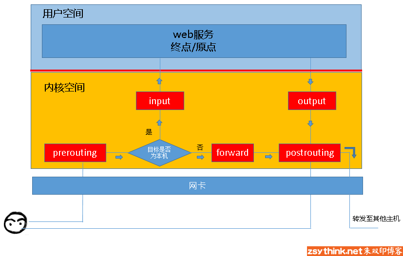

# iptables

iptables其实不是真正的防火墙,可以把它看作一个客户端代理,用户通过iptables这个代理,将用户的安全设定执行到对于的安全框架(netfliter)中; 虽然使用"service iptables start启动iptables '服务' ",但其实准确的说,iptables没有一个守护进程,所以不能算真正意义上的服务,而称为内核提供的功能更佳.

(1). netfilter 位于内核空间(kernelspace),是防火墙的安全框架.
(2). iptables 是一个命令行工具，位于用户空间(userspace)，它使插入、修改和除去信息包过滤表中的规则变得容易。

Netfliter的功能有:
- 网络地址转换(NAT)
- 数据包修改
- 数据包过滤

当客户端访问服务器的web服务时,客户端发送报文到网卡,而tcp/ip协议栈是属于内核的一部分,所以客户端的信息会通过内核的TCp协议传输到用户空间中的web服务中,而此时,客户端报文的目标终点是web服务器监听的套接字(IP:port).

当web服务器响应客户端请求时,发出响应报文的(IP:port)则成为了客户端,再经过内核空间流经网卡发出请求.

位于内核空间的Netfliter,所有报文的进出都要通过这些"关卡",而这些关卡在iptables称为"链".`5链4表`

## 规则、表和链

1. 规则(rules)

规则（rules）其实就是网络管理员预定义的条件，规则一般的定义为“如果数据包头符合这样的条件，就这样处理这个数据包”。规则存储在内核空间的信息包过滤表中，这些规则分别指定了源地址、目的地址、传输协议（如TCP、UDP、ICMP）和服务类型（如HTTP、FTP和SMTP）等。当数据包与规则匹配时，iptables就根据规则所定义的方法来处理这些数据包，如放行（accept）、拒绝（reject）和丢弃（drop）等。配置防火墙的主要工作就是添加、修改和删除这些规则。    
2. 链(chains)

链（chains）是数据包传播的路径，每一条链其实就是众多规则中的一个检查清单，每一条链中可以有一条或数条规则。当一个数据包到达一个链时，iptables就会从链中第一条规则开始检查，看该数据包是否满足规则所定义的条件。如果满足，系统就会根据该条规则所定义的方法处理该数据包；否则iptables将继续检查下一条规则，如果该数据包不符合链中任一条规则，iptables就会根据该链预先定义的默认策略来处理数据包。

3. 表(tables)

表（tables）提供特定的功能，iptables内置了4个表，即raw表、filter表、nat表和mangle表，分别用于实现包过滤，网络地址转换和包重构的功能。

> RAW 表; iptable_raw 关闭nat表上启用的连接追踪机制

只使用在PREROUTING链和OUTPUT链上,因为优先级最高，从而可以对收到的数据包在连接跟踪前进行处理。一但用户使用了RAW表,在 某个链上,RAW表处理完后,将跳过NAT表和 ip_conntrack处理,即不再做地址转换和数据包的链接跟踪处理了

> filter 表; iptables_filter 负责过滤功能

主要用于过滤数据包，该表根据系统管理员预定义的一组规则过滤符合条件的数据包。对于防火墙而言，主要利用在filter表中指定的规则来实现对数据包的过滤。Filter表是默认的表，如果没有指定哪个表，iptables 就默认使用filter表来执行所有命令，filter表包含了INPUT链（处理进入的数据包），RORWARD链（处理转发的数据包），OUTPUT链（处理本地生成的数据包）在filter表中只能允许对数据包进行接受，丢弃的操作，而无法对数据包进行更改

> NAT;iptable_nat 网络地址转换(network address translation)
NAT(NetWork Address Translation)
SNAT: (POSTROUTING,修改即将出去的包.修改的是来源IP,故称为Source NAt,SNAT)
DNAt: (PREROUTING,修改得到是即将到来的数据包.修改的是目的IP,故称为Destination NAt,DNAT)

> mangle表; iptable_mangle 拆解报文,做出修改并重新封装.

参考:

[iptables详解](https://blog.csdn.net/reyleon/article/details/12976341)

[iptables 分析](http://www.zsythink.net/archives/1199)