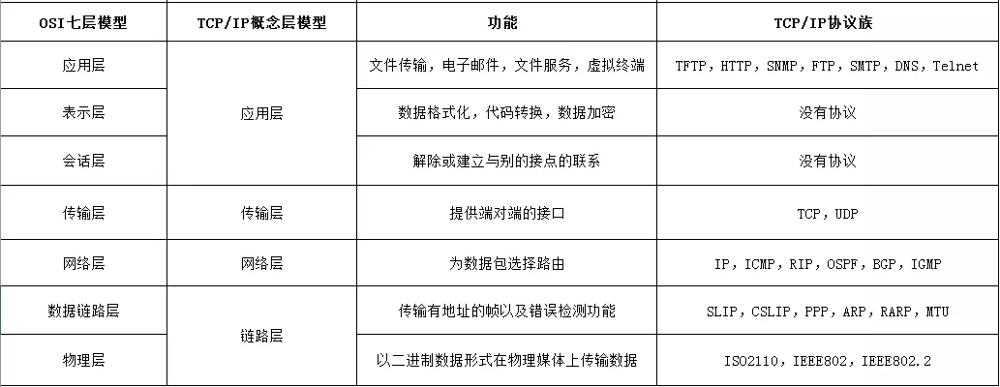
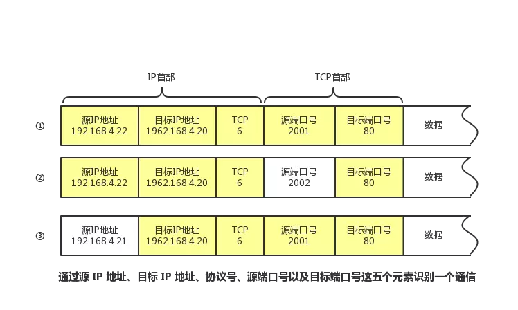

# TCP/IP协议族

互联网协议套件(英语：Internet Protocol Suite，缩写IPS)是一个网络通信模型，以及一整个网络传输协议家族，为网际网络的基础通信架构。它常被通称为TCP/IP协议族(英语：TCP/IP Protocol Suite，或TCP/IP Protocols)，简称TCP/IP。

[OSI模型和TCP/IP四层模型区别][OSI模型和TCP/IP四层模型区别]

## 传输层

每个应用协议一般都会使用到两个传输层协议之一:
- TCP: 面向连接的`Transmission Control Protocol`传输控制协议
- UDP: 无连接的包传输`User Data Protocol`用户数据报协议

| |UDP|	TCP
|-|-|-
|是否连接|	无连接|	面向连接
|是否可靠|	不可靠传输，不使用流量控制和拥塞控制|	可靠传输，实行"顺序控制"或"重发机制", 此外还具备"流量控制","拥塞控制",提高网络利用率等众多功能.
|连接对象个数|	支持一对一，一对多，多对一和多对多交互通信|	只能是一对一通信
|传输方式|	面向报文|	面向字节流
|首部开销|	首部开销小，仅8字节| 首部最小20字节，最大60字节
|场景|	适用于实时应用(IP电话、视频会议、直播等)|	适用于要求可靠传输的应用，例如文件传输

### 通信识别

- ① 和② 的通信是在两台计算机上进行的。它们的目标端口号相同，都是80。这里可以根据源端口号加以区分。
- ③ 和 ① 的目标端口号和源端口号完全相同，但它们各自的源 IP 地址不同。
- 此外，当 IP 地址和端口号全都一样时，我们还可以通过协议号来区分（TCP 和 UDP）。

### TCP协议图

### TCP状态机

参考:

[TCP/IP wiki](https://zh.wikipedia.org/wiki/TCP/IP%E5%8D%8F%E8%AE%AE%E6%97%8F)

[TCP/IP 协议掘金](https://juejin.im/post/5a069b6d51882509e5432656)

[OSI模型和TCP/IP四层模型区别]:https://blog.minhow.com/2017/01/07/protocol/tcp-osi/

[TCP三次握手原理 蛰剑](https://mp.weixin.qq.com/s?__biz=MzIzOTU0NTQ0MA==&mid=2247487779&idx=1&sn=0980243dcec05c5df8e2e60937c2c5ed&chksm=e9292c2cde5ea53a7b309e3575c78940a378b358292a3badb828d6c9bb6e8d3997800564b1d5&mpshare=1&scene=1&srcid=0705YKtkQfwoIBJorSbc9P6C&key=bdf2aa31ef4130cff6d1a3d40f6a443e01361dbb0604f3bdb4d6c7d9f7ad547361679b3c0c53dde796febe48f55d38d621aef26d1f8387eca847d862f32feff9f3360478f410999799023277a2afd6e9&ascene=1&uin=MTE5MjQ0MzcwOQ%3D%3D&devicetype=Windows+10&version=62060739&lang=zh_CN&pass_ticket=KufbyZ%2BG%2BfDdjYJR%2FqCfheEoAu1P2vVxjviuwztEkEKgigoWTk3aCR%2FLfRfaElcI)

[TCP 三次握手 CoolShell](https://coolshell.cn/articles/11564.html)

[莿鸟栖草堂 TCP SOCKET中backlog参数作用](https://www.cnxct.com/something-about-phpfpm-s-backlog/)

[TCP 三次握手参数解释](https://notfalse.net/26/tcp-seq)

[理解三次握手参数 译文](https://blog.csdn.net/a19881029/article/details/38091243)

[理解三次握手参数 raw](http://packetlife.net/blog/2010/jun/7/understanding-tcp-sequence-acknowledgment-numbers/)

[TCP流量控制](https://notfalse.net/24/tcp-flow-control)

[TCP 协议机制详解](https://juejin.im/post/5ba895a06fb9a05ce95c5dac)