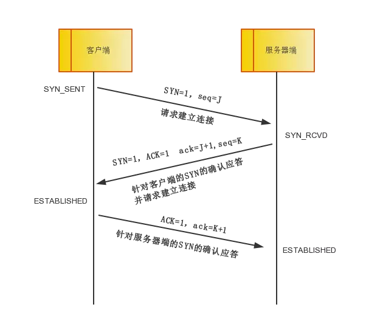

# TCP协议图

# TCP状态机

# TCP三次握手

TCP有链接通信传输,指在通信开始前做好两端之间的准备工作,所谓三次握手是指建立一个TCP连接时需要客户端和服务端总共发三个包以确认连接的建立.

> 术语解释

- TCP区段(Segment): 

    TCP Header + TCP Data

- IP包(Datagram): 

    IP Header + TCP Segment

- 序列号(Sequence Number, SEQ) 32 bits:

    包的序列号，并非从0开始,兩端會使用 ISN 產生器，產生各自的 初始序列號 (Initial Sequence Number, ISN), 目的是解决乱序问题;
    在 SYN flag 置 1 时，此为当前连接的初始序列号(Initial Sequence Number, ISN)，数据的第一个字节序号为此 ISN + 1
    在 SYN flag 置 0 时，为当前连接报文段的累计数据包字节数。
    作用: 接受端可以用表头中的SEQ进行排序,去重.

- 同步序列号(Synchronize sequence numbers, SYN): 

    TCP控制单元中的一个控制位.

- 确认号(Acknowledgment Number, ACK) 32 bits:

    ACK flag 置 1 时才有效，指接收方期待的下一个报文段的序列号,目的是解决丢包问题;

- TCP Flag: 也就是包的类型，主要是用于操控TCP的状态机的。

---

- 第一次握手: 客户端将`标志位SYN`置为1, 随机生成一个值`seq=J`,并将该数据包发送给服务器端,**客户端进入`SYN_SENT`状态**, 等待服务器端确认.

可理解为: c(client),s(server)说话时需要一个`SYN`同步开关, c对s说了一句话`seq=J`,然后c就进入`SYN_SENT`状态.

- 第二次握手: 服务器端收到数据包后由标志位`SYN=1`知道客户端请求连接,服务器端将`标志位SYN`和`标志位ACK`都置为1,`ack=J+1`,随机产生一个值`seq=K`,并将该数据包发送给客户端以确认连接请求,**服务器端进入`SYN_RECVD`状态**。

s听到c说的话后打开`ACK`确认开关,`SYN`同步开关,并对c说:"我知道你和我说的`ack=J+1`,我和你说一句话`seq=k`",然后s进入`SYN_RECVD`状态.

- 第三次握手: 客户端收到确认后, 检查`ack`是否为J+1,`标志位ACK`是否为1, 如果正确则将`标志位ACK`置为1,并将该数据包发送给服务器端;
服务器端检查`ack=K+1`,`标志位ACK=1`,若正确则连接建立成功,**客户端和服务器端进入ESTABLISHED状态**,完成三次握手,随后客户端与服务器端之间可以开始传输数据了.

c听到s的回复后,确认s理解的没问题,就打开`ACK`确认开关,c回复s:"你说的`ack=K+1`没有问题",最终s确认c的回复正确,两者连接建立成功.

参考:

[TCP/IP 协议掘金](https://juejin.im/post/5a069b6d51882509e5432656)

[TCP三次握手原理 蛰剑](https://mp.weixin.qq.com/s?__biz=MzIzOTU0NTQ0MA==&mid=2247487779&idx=1&sn=0980243dcec05c5df8e2e60937c2c5ed&chksm=e9292c2cde5ea53a7b309e3575c78940a378b358292a3badb828d6c9bb6e8d3997800564b1d5&mpshare=1&scene=1&srcid=0705YKtkQfwoIBJorSbc9P6C&key=bdf2aa31ef4130cff6d1a3d40f6a443e01361dbb0604f3bdb4d6c7d9f7ad547361679b3c0c53dde796febe48f55d38d621aef26d1f8387eca847d862f32feff9f3360478f410999799023277a2afd6e9&ascene=1&uin=MTE5MjQ0MzcwOQ%3D%3D&devicetype=Windows+10&version=62060739&lang=zh_CN&pass_ticket=KufbyZ%2BG%2BfDdjYJR%2FqCfheEoAu1P2vVxjviuwztEkEKgigoWTk3aCR%2FLfRfaElcI)

[TCP 三次握手 CoolShell](https://coolshell.cn/articles/11564.html)

[莿鸟栖草堂 TCP SOCKET中backlog参数作用](https://www.cnxct.com/something-about-phpfpm-s-backlog/)

[TCP 三次握手参数解释](https://notfalse.net/26/tcp-seq)

[理解三次握手参数 译文](https://blog.csdn.net/a19881029/article/details/38091243)

[理解三次握手参数 raw](http://packetlife.net/blog/2010/jun/7/understanding-tcp-sequence-acknowledgment-numbers/)