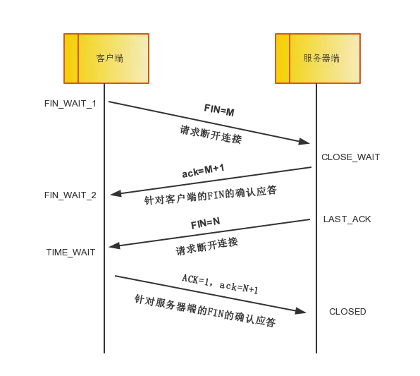

# TCP协议图

# TCP状态机

# TCP四次挥手

四次挥手即终止TCP连接,发四个包以确认连接的断开,在socket编程中,这一过程由客户端或服务端任一方执行close来触发.

由于TCP是全双工,故每个方向都必须要单独进行关闭,这一原则是当一方完成数据发送任务后,发送一个`标志符FIN`来终止这一方向的连接,收到一个`标志符FIN`只是意味着这一方向上没有数据流动了,即不会再收到数据了,但是这个TCP连接仍然能够发送数据,直到这一方向也发送了FIN.首先进行关闭的一方将执行主动关闭,而另一方则执行被动关闭.

> 一方主动关闭,另一方被动关闭的情况.

- 中断连接端可以是客户端,也可以是服务器端

- 第一次挥手: 客户端发送一个`FIN=M`,用来关闭客户端到服务器端的数据传送,**客户活动进入`FIN_WAIT_1`**状态。

可以理解为: c说"我没有话要和你说了,我要回家了",但是如果s还有数据没有发送完成,则不必急着关闭连接,可以继续发送数据.

- 第二次挥手: 服务器端收到`FIN`后,先发送`ack=M+1`,告诉客户端你的请求我收到了,但是我还没准备好,请你等我的消息.**客户端进入`FIN_WAIT_2`**状态,继续等到服务器端的`FIN`报文.

s听到c说的话后,向c说`ack=M+1`确认了,"你要回家"这个请求我收到了,但是s说我还没准备好,你等我的消息`FIN报文`;c此时就进入了`FIN_WAIT_2`状态进行等待

- 第三次挥手: 当服务器端确定数据已经发送完成,则向客户端发送`FIN=N`报文,告诉客户端好了,我这边准备号关闭连接了.**服务器端进入`LAST_ACK`状态**

s确定自己没什么话再同c讲了,就告诉c`FIN=N`;s此时口进入`LAST_ACK`状态.

- 第四次挥手: 客户端收到`FIN=N`报文后，就知道可以关闭连接了,但是他还是不相信网络,怕服务器不知道要关闭,所以发送`ack=N+1`后进入`TIME_WAIT`状态,如果Server端没有收到ACK则可以重传。服务器端收到`标志ACK`就知道可以断开连接了.客户端等待了`2MSL`后依然没有收到回复,则证明服务器端已经正常关闭,那好，客户端也可以关闭连接了.最终完成了四次握手.

c听到s说的`FIN=N`后进入`TIME_WAIT`状态, s没有听到`标志ACK`可以重传,若是听到`标志ACK`可以进入`CLOSED`断开连接;
c等待`2MSL`依然没有收到回复,则证明s已经正常关闭了,c也就进入`CLOSED`关闭状态了.

参考:

[TCP/IP 协议掘金](https://juejin.im/post/5a069b6d51882509e5432656)

[TCP 三次握手 CoolShell](https://coolshell.cn/articles/11564.html)