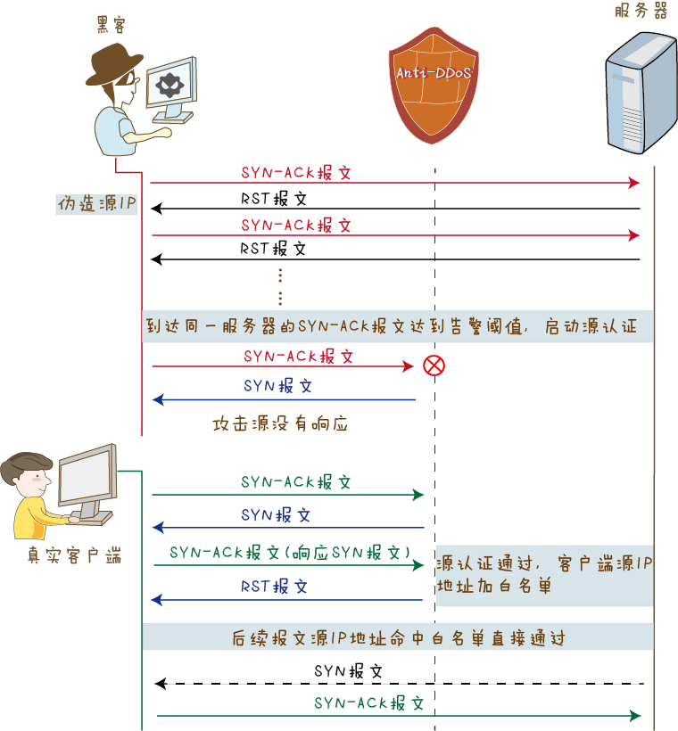
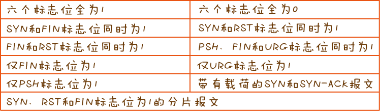

# TCP安全攻击手段

# Flood攻击

## SYN flood攻击


黑客伪造源IP地址向服务器发送大量`SYN报文`,请求建立三次握手.由于发送源IP是伪造的,所以服务器回应了`SYN-ACK报文`后,源IP不会再继续回应`ACK报文`进行确认.这样服务器就会维持一个庞大的等待列表,不停地重试发送`SYN-ACK报文`,同时占用这大量的资源无法释放. 这就导致被攻击的服务器被恶意半连接占满,不再接受SYN请求,合法用户无法完成三次握手建立TCP连接.

### 攻击
```sh
sudo apt-get install hping3
# sending 15000 packets 每个120 bytes; -c 15000 -d 120
# 确切指定 SYN Flag -S;
# -w 64指代TCP的 window size; -p port
# --flood 尽可能块地发送packets; --rand-source 生产欺骗性IP地址以伪装真实来源来避免检测但同时停止受害者的SYN-ACK回复数据包
hping3 -c 15000 -d 120 -S -w 64 -p 80 --flood --rand-source 192.168.1.159
```

### Anti-DDos 防御 SYN flood
SYN flood是基于TCP协议的,TCP是面向连接的,故可以从SYN报文建立连接的"行为"着手,判断是否是真实源发出的请求. **源认证**

1. 针对僵尸主机用伪造源IP对服务器SYN flood,对到达服务器的SYN报文进行统计,流量达到告警阈值时,触发防御机制.

2. Anti-DDos拦截SYN报文,并反弹错误序列号的SYN-ACK到客户端;
    - 若是虚假源,则不会响应SYN-ACK报文
    - 若是真实源,收到SYN-ACK报文后,会回应RST报文,要求重新建立连接

3. 将回应RST的客户端源IP加入白名单,并透过客户端重新发送SYN报文,客户端服务端建立三次握手,并进行后续数据传输.

---

## SYN-ACK Flood攻击


除了SYN报文之外,TCP交互过程中还存在SYN-ACK,ACK,FIN和RST报文这积累报文也可能导致被攻击目标系统资源耗尽.

通信双方通过三次握手建立一个TCP连接的过程中,SYN-ACK报文出现再第二次握手中,用来确认第一次握手.服务端接受到SYN-ACK报文后,首先会判断该报文是否属于三次握手范畴之内的报文.如果都没有进行第一次握手就直接收到了第二次握手的报文,那么就会向对方发送RST报文,告知对方其发来报文有误,不能建立连接.

SYN-ACK Flood攻击正是利用这一点,攻击者利用工具或操纵僵尸主机,向目标服务器发送大量的SYN-ACK报文,这些报文都属于凭空出现的第二次握手报文,服务器忙于回复RST报文,导致资源耗尽,不能响应正常的请求.

### 攻击
```
hping3 -c 15000 -d 120 -S -A -w 64 -p 80 --flood --rand-source 192.168.1.159
```

---

#### SYN-ACK防御

当连续一段时间内去往目标服务器的SYN-ACK报文超过告警阈值后,开启**源认证机制**.
1. Anti-DDos系统向SYN-ACK报文的源地址发送SYN报文.
    - 若这个源是虚假的,不会向Anti-DDos响应正确的SYN-ACK报文.
    - 若这个源是真实的,会向Anti-DDos系统响应正确的SYN-ACK报文。收到该SYN-ACK报文后,将该源加入白名单,同时会向源地址发送RST报文,断开自己和这个源地址的连接.
2. 后续这个源发出的SYN-ACK报文命中白名单直接通过,而对于那些未匹配白名单的SYN-ACK报文则继续进行源认证.

---
## ACK Flood

在TCP三次握手过程中,ACK报文出现在第三次握手中,用来确认第二次握手中的SYN-ACK报文.ACK报文利用大量的ACK报文,使服务器忙于回复这些凭空出现的第三次握手,导致资源耗尽,无法响应正常请求.

### 攻击
```
hping3 -c 15000 -d 120 -A -w 64 -p 80 --flood 
```


### ACK 防御

使用**会话检查**方式防御ACK Flood攻击, 它是状态检测防火墙的一个机制,是防火墙的最基本功能.对于一次正常的TCP连接建立过程来说,必须先是SYN,接着是SYN-ACK,然后才是ACK报文,所谓有"因"才有"果".只有ACK报文命中了会话,才认为是真实报文.

会话检查分为基本和严格两种模式:
- 基本模式
若ACK报文没有命中会话,Anti-DDos系统会运行第一个ACK报文通过并建立会话,以此来对后续ACK报文进行会话检查;如果ACK报文命中了会话,则继续检查报文的序列号,序列号正确允许通过,序列号不正确则被丢弃.

- 严格模式
Anti-DDos对会话检查时,如果ACK报文没有命中会话,直接丢弃报文;如果ACK命中会话,并且序列号正确,允许报文通过.
在旁路部署动态引流的场景,由于报文来回路径不一致,正常业务的ACK报文会因为没有命中会话而被丢弃,因此对正常业务有一定的影响.

---
## FIN/RST Flood

TCP交互过程中还存在FIN和RST报文,FIN报文用来关闭TCP连接,RST报文用来断开TCP连接.这两种报文用来发起DDos,导致目标服务器资源耗尽,无法响应正常请求.

### 攻击
```
hping3 -c 15000 -d 120 -A -w 64 -p 80 --flood 
```

### FIN/RST Flood 防御

使用**会话检查**机制来防御FIN/RST Flood攻击,如果FIN/RST报文没有命中会话,直接丢弃;如果FIN/RST报文命中会话,则会根据会话创建原因和会话检查结果判断该报文是否通过:
- 如果会话是由SYN或SYN-ACK报文创建的,则允许该FIN/RST报文通过.
- 如果会话是由其他报文创建的(例如ACK报文),则进一步检查报文序号是否正确,序号正确的报文允许通过,序号不正确的报文则被丢弃.


参考:

[华安解密之 DDos](https://forum.huawei.com/enterprise/zh/thread-360365-1-1.html)

[kali tcp syn flood](http://www.firewall.cx/general-topics-reviews/network-protocol-analyzers/1224-performing-tcp-syn-flood-attack-and-detecting-it-with-wireshark.html)

[hping3 DDos](https://www.darkmoreops.com/2014/08/21/dos-using-hping3-spoofed-ip-kali-linux/)

# TCP 连接耗尽

TCP是面向连接的协议,通信双方必须保持连接状态,并且通过确认,重传,滑动窗口等机制,保证数据传输的可靠性和稳定性.
攻击者利用TCP上述特点,在TCP连接上做文章,利用TCP连接来消耗被攻击目标的系统资源.

## 攻击与防御
例如
1. 攻击者与被攻击目标完成三次握手后,立即发送FIN或RST报文,释放本段连接,同时快速地发起新连接,消耗系统资源.

防: 通过检查新建连接的速率来防御此类攻击.首先针对受保护目标进行统计,当受保护目标的TCP新建连接速率超过阈值,启动防御.然后针对源进行统计,如果某个源IP在指定时间间隔发起TCP新建连接数超过阈值,则将该源IP加入黑名单.

2. 攻击者与被攻击者完成三次握手,发送很少的报文来维持连接状态,通过这种异常的TCP连接来消耗目标系统的系统资源.

防: 通过异常会话检查来防御此类攻击。如果受保护目标的TCP连接上特定时间内通过报文数小于阈值,则认为该连接为异常。特定时间内某个源IP的异常会话数超过阈值,则将该源IP加入黑名单.

还有其他手段,比如构造大量的并发连接,设置很小的TCP窗口,发送重传报文等.

防御手法一般是基于会话机制,通过新建连接速率检查,并发连接数检查,异常会话检查等措施,将攻击源加入黑名单,阻断攻击.

---


# TCP 异常报文攻击

TCP报文头中存在六个标志位字段，代表不同的含义，标志位的值置为1，表示该标志位起作用。我们在前面介绍TCP连接建立和断开过程时，提到过SYN、ACK和FIN标志位，下面是这六个标志位的详细信息:

-  URG：置1时表示紧急指针有效。

-  ACK：置1时表示确认序号有效。

-  PSH：置1时表示接收方收到数据段后应该尽快送到应用程序。

-  RST：置1时表示重新建立连接。

-  SYN：置1时表示发起一个连接。

-  FIN：置1时表示发送方完成发送任务，释放连接。

